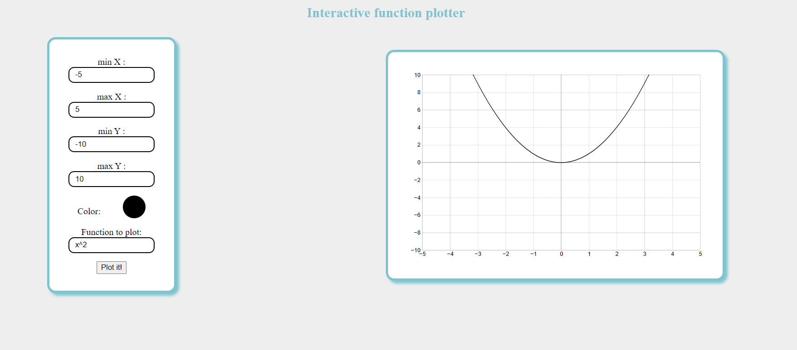
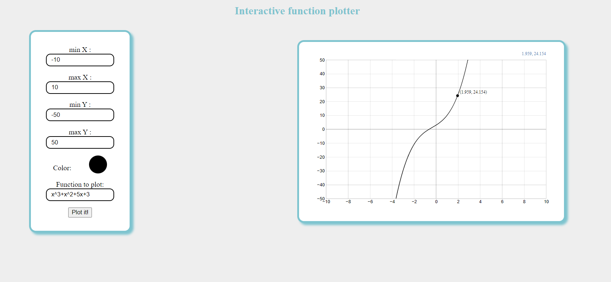
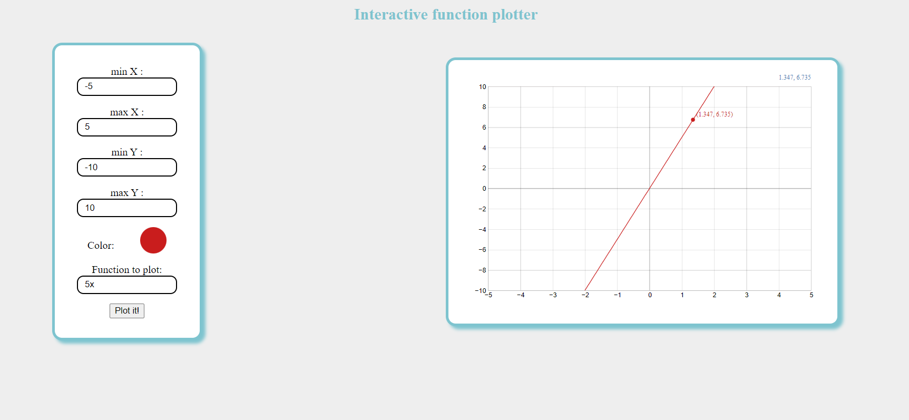
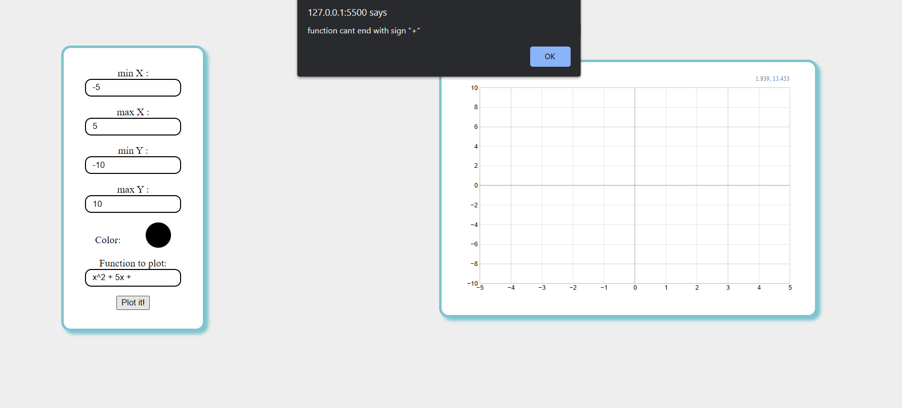
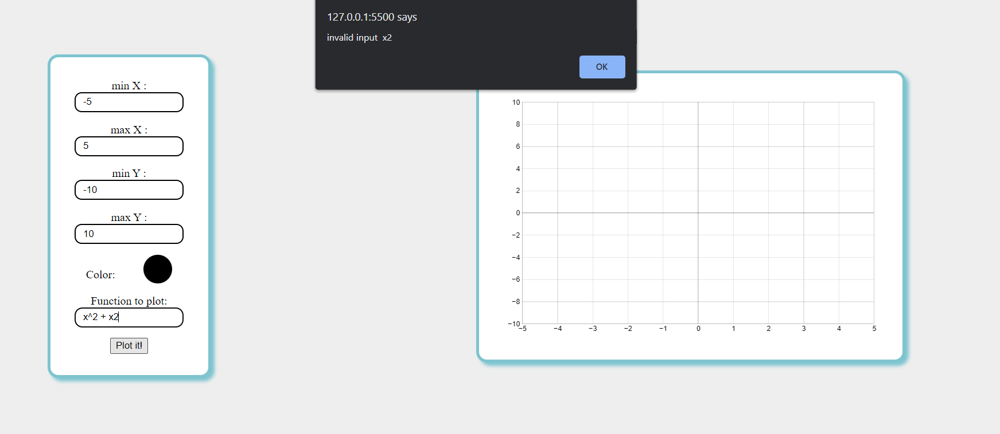

# function-plotter-

master micro intern task1: an interactive function plotter built using HTML , CSS  , vanilla JS  

## 🏁 Watch Live

## 💻 Built Using 

- **HTML**
- **CSS**
- **Vanilla JS**

## 📷 Screenshots
 
                     
 </a> 
 
                                                        
 </a> 
 
                                                        
 </a> 
 
                                                        
 </a> 
 
                                                        
 </a> 
 
                                                        
 </a> 
 

